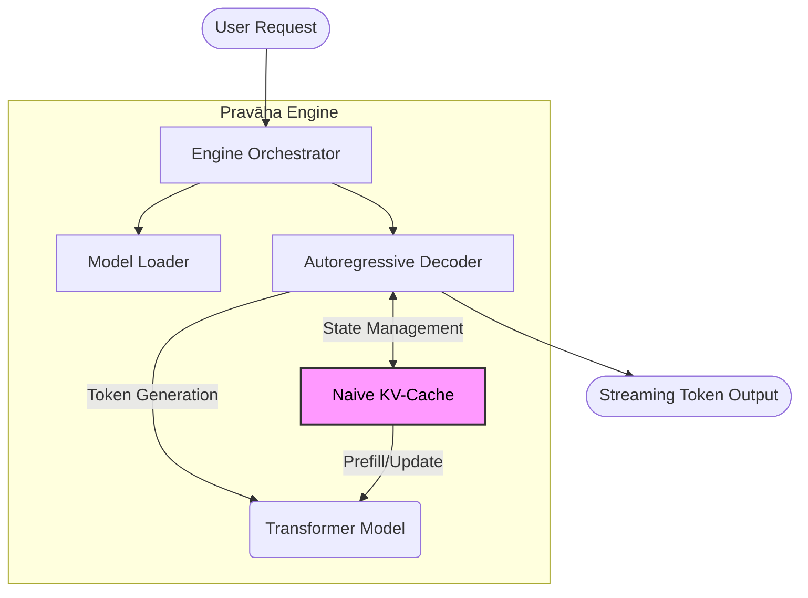

# Pravāha — प्रवाह

**A vLLM-inspired LLM inference engine with continuous batching and PagedAttention.**

Pravāha means "flow/stream" in Sanskrit, symbolizing continuous batching and token streaming.

## Architecture



## Features (Phase 1 & 2 Completed)

- ✅ **HuggingFace Model Loading**: Support for GPT-2, Llama, Mistral with configurable device mapping.
- ✅ **Naive KV-Cache (Phase 2)**: Custom Python-based Key-Value cache for deterministic memory usage and zero fragmentation.
- ✅ **Streaming Generation**: Low-latency token streaming (<10ms).
- ✅ **Configurable Dtype**: FP16/BF16/FP32 support.
- ✅ **Sampling Pipeline**: Temperature, Top-K, Top-P, Repetition Penalty.

## 🎥 Demos

**Phase 1: Foundation** (Baseline Inference)
https://github.com/user-attachments/assets/32ba41bb-b0ea-45ff-b167-ae13927faeaf

**Phase 2: Acceleration** (Naive KV-Cache + Streaming)
https://github.com/user-attachments/assets/ea9071da-2285-4f15-a385-c551eada8882

## Roadmap

- ✅ **Phase 1: Foundation (Loader & Inference)**
- ✅ **Phase 2: Naive KV-Cache + Streaming Generation**
  - _Implemented_: A custom, pre-allocated KV-cache that provides 100% visibility into memory usage (e.g., 36MB for GPT-2). This replaces the opaque HuggingFace cache, giving us full control over state management.
- ✅ **Phase 3: Continuous Batching Scheduler**
  - _Implemented_: A slot-based dynamic scheduler operating in a background thread with an `asyncio` frontend. It handles disjoint batched prefill and batched decode passes for multiple concurrent users.
- 🔲 **Phase 4: Paged KV-Cache + BlockAllocator**
- 🔲 **Phase 5: INT8/INT4 Quantization (GPTQ/AWQ)**
- 🔲 Phase 6: API Server + Streaming
- 🔲 Phase 7: Metrics + Profiler
- 🔲 Phase 8: FlashAttention + Speculative Decoding

## Quick Start

```bash
# Install
pip install -e ".[dev]"

# Run
python -c "
from pravaha.engine import PravahaEngine
engine = PravahaEngine()
for token in engine.generate('Once upon a time', max_new_tokens=50, temperature=0.8):
    print(token, end='', flush=True)
print()
"

# Tests
python -m pytest tests/ -v             # Fast tests only
python -m pytest tests/ -v --run-slow  # All tests (downloads models)
```

## Project Structure

```
pravaha/
├── config.py           # Pydantic configuration system
├── engine.py           # Top-level inference orchestrator
├── models/
│   ├── loader.py       # HuggingFace model loading
│   ├── model_config.py # Architecture detection
│   └── weights.py      # Weight loading utilities
├── tokenizer/
│   └── tokenizer.py    # HuggingFace tokenizer wrapper
├── decoder/
│   ├── decoder.py      # Autoregressive decode loop
│   └── sampling.py     # Sampling strategies
├── scheduler/
│   └── request.py      # Request/sequence data structures
├── kv_cache/           # (Phase 2-4)
├── quantization/       # (Phase 5)
├── server/             # (Phase 6)
└── metrics/            # (Phase 7)
```

## License

MIT
