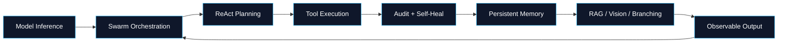
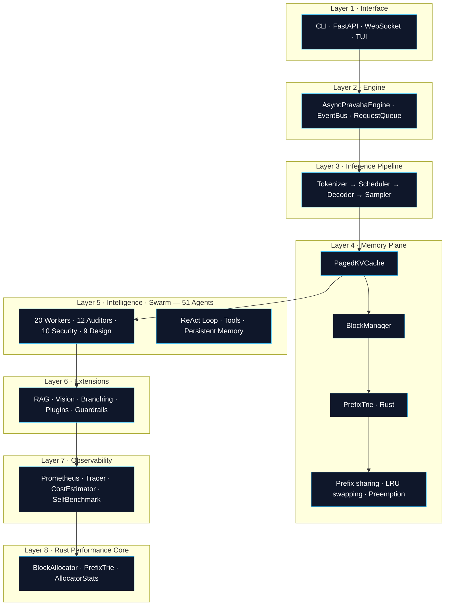

<div align="center">

<!-- HERO -->


<a href="https://github.com/pravaha/pravaha">
  
</a>

<br />


<br /><br />

<details open>
<summary><b>Live system pulse</b></summary>

```text
┌──────────────────────────────────────────────────────────────────────────────┐
│  PRAVAHA v3.2 · Swarm mode · Self-heal ON · Memory ON · Rust core ACTIVE   │
├──────────────────────────────────────────────────────────────────────────────┤
│  INFERENCE FLOW  →  SCHEDULER  →  DECODER  →  SWARM  →  AUDIT  →  OUTPUT    │
│                                                                             │
│  Avatar: idle ▸ thinking ▸ working ▸ auditing ▸ success                     │
│  Agents: 51 total  |  ReAct enabled  |  Tools sandboxed  |  Branching ON    │
│  Observability: Prometheus ▸ Tracer ▸ CostEstimator ▸ SelfBenchmark         │
└──────────────────────────────────────────────────────────────────────────────┘
```

</details>

<br />


</div>

---

## Why Pravāha?

Most LLM inference tools solve **one** problem. Pravāha solves **all of them** — and wraps them in an autonomous orchestration layer.

<details open>
<summary><b>Flow map</b></summary>


```mermaid
%%{init: {'flowchart': {'curve': 'basis'}}}%%
flowchart LR
  A["Model Inference"] --> B["Swarm Orchestration"]
  B --> C["ReAct Planning"]
  C --> D["Tool Execution"]
  D --> E["Audit + Self-Heal"]
  E --> F["Persistent Memory"]
  F --> G["RAG / Vision / Branching"]
  G --> H["Observable Output"]
  H --> B

  classDef cyber fill:#0f172a,stroke:#38bdf8,color:#ffffff,stroke-width:1px;
  class A,B,C,D,E,F,G,H cyber;
```

</details>

| Capability | vLLM | Ollama | llama.cpp | **Pravāha v3.1** |
|---|:---:|:---:|:---:|:---:|
| Continuous Batching | ✅ | ✅ | ✅ | ✅ |
| PagedAttention | ✅ | ✅ | ✅ | ✅ |
| OpenAI-Compatible API | ✅ | ✅ | ✅ | ✅ |
| 51-Agent Autonomous Swarm | ❌ | ❌ | ❌ | ✅ |
| ReAct Loop (Reason + Act) | ❌ | ❌ | ❌ | ✅ |
| Self-Healing Audit Loop | ❌ | ❌ | ❌ | ✅ |
| Persistent Agent Memory | ❌ | ❌ | ❌ | ✅ |
| Sandboxed Tool Execution | ❌ | ❌ | ❌ | ✅ |
| 10 Security Audit Agents | ❌ | ❌ | ❌ | ✅ |
| 9 Design Agents | ❌ | ❌ | ❌ | ✅ |
| Built-in RAG Pipeline | ❌ | ✅ | ❌ | ✅ |
| Vision Routing | ❌ | ✅ | ❌ | ✅ |
| Conversation Branching | ❌ | ❌ | ❌ | ✅ |
| Terminal Dashboard (TUI) | ❌ | ❌ | ❌ | ✅ |
| Pixel Avatar Animation | ❌ | ❌ | ❌ | ✅ |
| Rust Performance Core | ✅ | ❌ | ✅ | ✅ |
| Plugin System | ❌ | ❌ | ❌ | ✅ |
| Token-Level Debugging | ❌ | ❌ | ❌ | ✅ |

> **Think of it this way:**
> - **LLaMA** = the car engine 🛠️
> - **CUDA** = the fuel ⛽
> - **Pravāha** = the entire self-driving race car 🏎️ with pit crew, dashboard, and autopilot

---

## What Makes v3.1 Different: True Autonomy

Every agent in Pravāha v3.1 uses the **ReAct (Reason + Act) loop**:

```text
THINK → ACT → OBSERVE → THINK → ACT → OBSERVE → ... → ANSWER
```

This is NOT prompt wrapping. Agents:

1. **Plan** their own sub-steps before executing  
2. **Execute real tools** (code runner, web search, file reader)  
3. **Observe** results and adapt  
4. **Persist memory** across sessions (SQLite-backed)  
5. **Self-heal** through a 12-auditor feedback loop  

---

## Quick Start

### One-Command Serving

```bash
# Install
pip install -e ".[all]"

# Serve any HuggingFace model with one command
pravaha serve gpt2
pravaha serve meta-llama/Llama-3-8B --quantize 4bit --tui
pravaha serve mistralai/Mistral-7B --swarm --self-heal --rag --tui

# Interactive chat
pravaha chat --server http://localhost:8000

# Run benchmarks
pravaha bench --model gpt2 --runs 5
```

### Python API

```python
from pravaha.engine.async_engine import AsyncPravahaEngine
from pravaha.config.engine_config import EngineConfig

config = EngineConfig(model_name="gpt2", quantization="4bit")
engine = AsyncPravahaEngine(config=config)

async for token in engine.generate("Explain quantum computing"):
    print(token, end="", flush=True)
```

### Docker

```bash
docker compose -f docker/docker-compose.yml up
```

---

## Architecture

<details open>
<summary><b>Interactive architecture stack</b></summary>


```mermaid
%%{init: {'flowchart': {'curve': 'basis'}}}%%
flowchart TB
  subgraph L1["Layer 1 · Interface"]
    A1["CLI · FastAPI · WebSocket · TUI"]
  end

  subgraph L2["Layer 2 · Engine"]
    A2["AsyncPravahaEngine · EventBus · RequestQueue"]
  end

  subgraph L3["Layer 3 · Inference Pipeline"]
    A3["Tokenizer → Scheduler → Decoder → Sampler"]
  end

  subgraph L4["Layer 4 · Memory Plane"]
    A4["PagedKVCache"]
    A5["BlockManager"]
    A6["PrefixTrie · Rust"]
    A7["Prefix sharing · LRU swapping · Preemption"]
    A4 --> A5 --> A6 --> A7
  end

  subgraph L5["Layer 5 · Intelligence · Swarm — 51 Agents"]
    A8["20 Workers · 12 Auditors · 10 Security · 9 Design"]
    A9["ReAct Loop · Tools · Persistent Memory"]
  end

  subgraph L6["Layer 6 · Extensions"]
    A10["RAG · Vision · Branching · Plugins · Guardrails"]
  end

  subgraph L7["Layer 7 · Observability"]
    A11["Prometheus · Tracer · CostEstimator · SelfBenchmark"]
  end

  subgraph L8["Layer 8 · Rust Performance Core"]
    A12["BlockAllocator · PrefixTrie · AllocatorStats"]
  end

  A1 --> A2 --> A3 --> A4 --> A8 --> A10 --> A11 --> A12

  classDef cyber fill:#0f172a,stroke:#38bdf8,color:#ffffff,stroke-width:1px;
  class A1,A2,A3,A4,A5,A6,A7,A8,A9,A10,A11,A12 cyber;
```

</details>

---

## 51-Agent Swarm

### Workers (20 agents)

| Agent | Role | ReAct? | Tools |
|-------|------|:------:|-------|
| PlannerAgent | Task decomposition | ✅ | memory |
| CoderAgent | Code generation + verification | ✅ | execute_python, read_file, web_search |
| DebuggerAgent | Root cause analysis + fix | ✅ | execute_python, read_file |
| ResearcherAgent | Web research + cross-reference | ✅ | web_search, fetch_url |
| ReasoningAgent | Chain-of-thought + math verify | ✅ | execute_python |
| CriticAgent | Quality critique | — | — |
| ValidatorAgent | Output validation | — | — |
| SummarizerAgent | Text summarization | — | — |
| ExpanderAgent | Content expansion | — | — |
| TranslatorAgent | Language translation | — | — |
| MergerAgent | Output merging | — | — |
| RouterAgent | Task routing | — | — |
| MemoryAgent | Memory management | — | — |
| ToolAgent | Tool orchestration | ✅ | all tools |
| JudgeAgent | Quality judging | — | — |
| RefinerAgent | Output refinement | — | — |
| ClassifierAgent | Task classification | — | — |
| ExtractorAgent | Data extraction | — | — |
| NarratorAgent | Narrative writing | — | — |
| EnsembleAgent | Multi-model ensemble | — | — |

### Auditors (12 agents)

Static regex-first analysis with zero LLM cost for detection.

| Agent | Patterns | Focus |
|-------|:--------:|-------|
| SyntaxAuditAgent | 7 | eval, exec, bare except, star import, mutable default, global, assert |
| TypeSafetyAgent | 3 | isinstance chains, bare type(), Any overuse |
| LogicFlawAgent | 4 | == None, while True break, unreachable code, empty catch |
| PerformanceProfilerAgent | 3 | nested loops, string concat, repeated computation |
| ConsistencyGuardAgent | — | Cross-output consistency |
| HallucinationHunterAgent | — | Factual verification |
| EdgeCaseHunterAgent | — | Boundary conditions |
| OutputVerifierAgent | — | Final quality gate |
| PatchApplierAgent | — | Auto-fix issues |
| SelfReflectionAgent | — | Meta-cognitive review |
| TestGeneratorAgent | — | Auto-generate tests |
| RegressionGuardAgent | — | Detect regressions from patches |

### Security Agents (10)

| Agent | Patterns | CVSS? | Focus |
|-------|:--------:|:-----:|-------|
| SecurityAuditAgent | 12 | ✅ | eval/exec/pickle + CWE mapping |
| InjectionScannerAgent | 10 | — | SQL/XSS/XXE/command/template injection |
| AuthAuditAgent | 5 | — | JWT, session fixation, hardcoded creds |
| CryptoAuditAgent | 8 | — | MD5/SHA1/DES/RC4/ECB/weak keys |
| DependencyAuditAgent | 6 | — | pickle/marshal/ctypes/telnet |
| SecretsScannerAgent | 8+entropy | — | AWS/GitHub/OpenAI/Slack + Shannon entropy |
| NetworkSecurityAgent | 5 | — | HTTP/SSL/CORS/bind/SSRF |
| PrivilegeAuditAgent | 5 | — | Root escalation, chmod 777 |
| APISecurityAgent | 4 | — | Rate limiting, header injection |
| ComplianceAgent | 5 | — | GDPR/PCI/OWASP logging |

### Design Agents (9)

| Agent | Role | Tools | Focus |
|-------|------|-------|-------|
| UIDesignerAgent | ui_designer | web_search | Layout + visual + interaction specs |
| ComponentBuilderAgent | component_builder | execute_python | React/HTML/CSS components |
| LayoutAgent | layout_designer | — | CSS Grid/Flexbox layouts |
| StyleAgent | style_designer | — | Design token systems |
| AccessibilityAgent | accessibility_auditor | — | WCAG 2.1 AA compliance (6 checks) |
| UXReviewerAgent | ux_reviewer | — | Nielsen's 10 heuristics |
| DesignCriticAgent | design_critic | — | 5-dimension scoring |
| PrototypeAgent | prototype_builder | read_file | Single-file HTML prototypes |
| DesignSystemAgent | design_system | — | Token + pattern library |

---

## Tool System

Agents can execute **real tools** during the ReAct loop.

| Tool | Name | Description | Security |
|------|------|-------------|----------|
| CodeExecutor | `execute_python` | Subprocess sandbox, 5s timeout | No shell=True, 8KB max output |
| FileReader | `read_file` | Whitelisted extensions only | .py,.js,.ts,.md,.json,.yaml,.toml |
| WebFetcher | `fetch_url` | HTTP GET + HTML→text | 10s timeout, follow redirects |
| SearchTool | `web_search` | DuckDuckGo API | No API key needed |
| ShellRunner | `run_shell` | Whitelisted commands only | Blocked: rm, sudo, chmod, curl |
| MemoryTool | `memory` | Agent-scoped SQLite store | Namespaced per agent role |

---

## Persistent Memory

Agents maintain memory across sessions via SQLite in WAL mode.

| Module | Purpose | Key Feature |
|--------|---------|-------------|
| `MemoryStore` | Key-value store | Importance weighting, access-time tracking |
| `EpisodicMemory` | Task-result episodes | Keyword-overlap recall for learning |
| `SemanticMemory` | Fact store | TF-IDF cosine similarity |

---

## Rust Performance Core

| Module | Thread Safety | Key Methods |
|--------|:------------:|-------------|
| `BlockAllocator` | — | allocate, free, batch_allocate, evict_lru_batch |
| `PrefixTrie` | `Arc<RwLock>` | insert, longest_prefix_match, decrement_ref |
| `AllocatorStats` | — | hit_rate(), utilization(), alloc_free_ratio() |

---

## TUI Dashboard

<details open>
<summary><b>Console view</b></summary>

```text
┌──────────────────────────────────────────────────────┐
│  PRAVAHA v3.1  ·  Llama-3  ·  4-bit  ·  RTX4090     │
├──────────┬───────────────────┬────────────────────────┤
│ [AVATAR] │   Chat Panel      │   Metrics Panel        │
│  ╭━━━━━╮ │   (streaming)     │   Throughput gauge      │
│  │ ◉  ◉ ││                   │   VRAM gauge            │
│  │  ━   ││                   │   Queue bar             │
│  ╰━━━━━╯ │                   │                        │
├──────────┴───────────────────┴────────────────────────┤
│  Agents: [plan●][code●][crit○][synx●][halu○]...       │
├──────────────────────────────────────────────────────┤
│  Audit: [SyntaxAudit: scanning...] iter=1 issues=2   │
├──────────────────────────────────────────────────────┤
│  Logs: 14:22:31 INFO Prefill batch=4, time=1.02s     │
└──────────────────────────────────────────────────────┘
```

</details>

Avatar states: **idle** (cyan) → **thinking** (yellow) → **working** (green) → **audit** (magenta) → **success** (green ✦)

---

## Pipelines

| Pipeline | Workers | Auditors |
|----------|---------|----------|
| `plan-execute-audit` | planner → coder → critic | syntax + security + verifier |
| `research-summarize` | researcher → reasoning → summarizer | hallucination + consistency |
| `code-review` | coder → debugger → critic → refiner | syntax + type + security + perf + test |
| `secure-code-review` | planner → coder → debugger | ALL 10 security agents |
| `design-component` | ui_designer → layout → style → builder | accessibility + UX + critic |
| `full-secure-design` | planner → designer → builder → coder → debug | security + design + perf |

---

## Configuration

YAML-based with layered defaults.

```text
configs/
├── default.yaml          # Full engine configuration
├── phase1.yaml           # Minimal CPU testing
├── swarm_default.yaml    # 51-agent swarm configuration
└── rag_default.yaml      # RAG pipeline configuration
```

---

## Testing

```bash
# Run all tests (76 tests)
pytest tests/ -v

# Run with coverage
pytest tests/ --cov=pravaha

# Run specific test suites
pytest tests/test_swarm.py           # Agent registry (51 agents)
pytest tests/test_security_agents.py # Security static scans
pytest tests/test_design_agents.py   # Accessibility + design
pytest tests/test_react_loop.py      # ReAct loop + tools
pytest tests/test_memory.py          # Persistent memory
pytest tests/test_agents_runtime.py  # Real agent runtime
```

---

## Project Structure

```text
pravaha/
├── cli/                    # CLI commands (Typer + Rich)
├── config/                 # Configuration system (Pydantic)
├── engine/                 # Async inference engine + EventBus
├── scheduler/              # Continuous batching scheduler
├── decoder/                # Model forward pass + sampling
├── memory/                 # PagedKVCache + BlockManager
├── tokenizer/              # HuggingFace tokenizer wrapper
├── serving/                # FastAPI server + 11 routes
├── swarm/
│   ├── agents/
│   │   ├── workers/        # 20 worker agents (5 ReAct-enabled)
│   │   ├── auditors/       # 12 audit agents (regex-first)
│   │   ├── security/       # 10 security agents (CVSS+CWE)
│   │   └── design/         # 9 design agents (WCAG+Nielsen)
│   ├── tools/              # 6 sandboxed tools
│   ├── memory/             # SQLite persistent memory
│   ├── orchestrator.py     # Agent coordination
│   └── pipeline.py         # 8 named pipelines
├── tui/                    # Terminal dashboard + avatar
├── rag/                    # RAG pipeline (FAISS + embeddings)
├── vision/                 # Multimodal vision routing
├── branching/              # Conversation branching
├── debug/                  # Replayer + StepDebugger + Tracer
├── plugins/                # Plugin system
├── guardrails/             # Content filtering
├── observability/          # Prometheus + cost estimation
└── rust/src/               # Rust performance core
    ├── allocator.rs         # Block allocator + batch ops
    ├── prefix_trie.rs       # O(1) prefix matching trie
    ├── stats.rs             # Allocation statistics
    └── lib.rs               # PyO3 module exports
```

---

## Compared to vLLM

Pravāha is **not** a replacement for vLLM in production inference workloads. vLLM uses custom CUDA kernels and achieves 3–5x higher throughput for pure token generation.

Pravāha's advantage is the **intelligent layer**: when you need agents, self-healing output, built-in RAG, and observable workflows — not just raw token throughput.

| Dimension | vLLM | Pravāha |
|-----------|------|---------|
| Raw throughput | ✅ Custom CUDA kernels | ❌ Wraps HuggingFace Transformers |
| Agent swarm | ❌ | ✅ 51 autonomous agents |
| Self-healing | ❌ | ✅ Audit loop with patch verification |
| Built-in RAG | ❌ | ✅ FAISS + embeddings |
| Memory | ❌ | ✅ SQLite persistent agent memory |
| Tool execution | ❌ | ✅ 6 sandboxed tools |

**Inference Performance Note:** Pravāha's inference path wraps HuggingFace Transformers. It does not use custom CUDA kernels. Benchmarks vary by hardware. GPT-2 on CPU: ~80ms TTFT. Llama-3-8B on A100 with 4-bit: approximately 40–60ms TTFT.

---

## License

MIT — see [LICENSE](LICENSE) for details.

---

<div align="center">


### ✦ Pravāha v3.2
### The self-healing, swarm-powered LLM inference framework.
### Not a swarm of system prompts. A genuine inference framework with autonomous agents.

</div>
