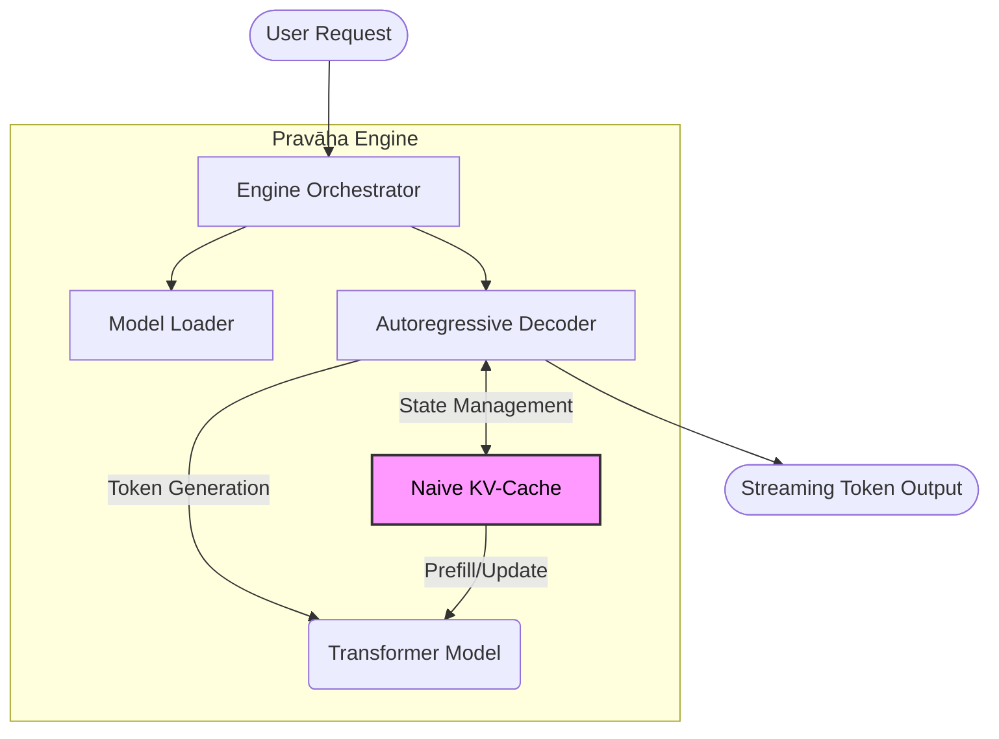

# Pravāha — प्रवाह

**A vLLM-inspired LLM inference engine with continuous batching and PagedAttention.**

Pravāha means "flow/stream" in Sanskrit, symbolizing continuous batching and token streaming.

## Architecture


```mermaid
graph TD
    User([User Request]) --> Engine
    subgraph Pravaha [Pravāha Engine]
        Engine[Engine Orchestrator] --> Loader[Model Loader]
        Engine --> Decoder[Autoregressive Decoder]
        Decoder -->|Token Generation| Model(Transformer Model)
        Decoder <-->|State Management| KVCache[Naive KV-Cache]
        KVCache -->|Prefill/Update| Model
    end
    Decoder --> Output([Streaming Token Output])
    style KVCache fill:#f9f,stroke:#333,stroke-width:2px,color:#000
```

## ✨ Features (Phases 1-5 Completed)

- ✅ **INT8 & INT4 Quantization (Phase 5)**: Native integration with `bitsandbytes` allows loading massive models on consumer GPUs by reducing weight precision (e.g., slashing VRAM footprint by ~50% in 4-bit mode) without sacrificing the custom KV-cache architecture.
- ✅ **Hybrid Paged Attention (Phase 4)**: Transitions from contiguous slots to a high-performance paged memory system. Uses a **Rust-based BlockAllocator** for O(1) memory management and **PagedKVCache** for efficient GPU/CPU block movements.
- ✅ **LRU Swapping & Preemption**: Automatically handles memory pressure by swapping least-recently-used KV-cache blocks to system RAM, enabling much higher sequence counts than physical VRAM allowed.
- ✅ **Prefix Sharing**: Radical memory optimization that allows multiple concurrent requests to share physical memory blocks for identical prompt prefixes.
- ✅ **Continuous Batching Scheduler (Phase 3)**: A dynamic, slot-based execution engine that maximizes GPU utilization by grouping incoming requests in an asynchronous `asyncio` background loop.
- ✅ **Custom KV-Cache Management (Phase 2)**: 100% Python-based pre-allocated Key-Value cache for multi-layered transformer blocks. Provides precise visibility into memory allocation (e.g., exactly 144MB for a 4-slot GPT-2 cache) and fully replaces opaque native HF caching.
- ✅ **HuggingFace Native Interoperability (Phase 1)**: Zero-friction model loading for state-of-the-art architectures (GPT-2, Llama, Mistral) through dynamic state conversion, bringing advanced batching to standard huggingface checkpoints without kernel modification.
- ✅ **High-Performance Streaming Generation**: Fully unblocked end-to-end token streaming driven by decoupled background threads queueing natively to `asyncio` event loops.
- ✅ **Precision Controls**: Configurable FP16, BF16, and FP32 torch datatypes natively managed at loop initiation.
- ✅ **Configurable Sampling Pipeline**: Robust generation controls including Temperature, Top-K, Top-P stochastic sampling, and custom stop-word parameters.

## 📈 Roadmap & Technical Achievements

- ✅ **Phase 1: Foundation (Loader & Engine Scaffold)**
  - _Goal:_ Create a lightweight inference orchestrator.
  - _Achievement:_ Implemented the base `PravahaEngine`, decoupling tokenization and model weights while proving the feasibility of streaming inference.

- ✅ **Phase 2: Acceleration (Naive KV-Cache + Deterministic State)**
  - _Goal:_ Strip control from HuggingFace auto-regressive generation loops.
  - _Achievement:_ Built a custom `NaiveKVCache` that pre-allocates exactly the tensors required for continuous inference instead of constantly resizing memory arrays. This removed the opaque HF caching and unlocked the data structures fundamentally required for concurrent multi-sequence scheduling.

- ✅ **Phase 3: Continuous Batching Scheduler**
  - _Goal:_ Substantially increase hardware throughput via concurrent inference.
  - _Achievement:_ Designed an asynchronous frontend wrapped around a synchronous PyTorch thread-loop. The `ContinuousScheduler` handles concurrent inputs by employing **Disjoint Execution Phases**. It waits to batch un-allocated requests together for an isolated _Batched Prefill Pass_, and then cleanly executes multi-sequence _Batched Decode Passes_, dynamically hiding single-batch latency to near zero (e.g., executing 4 concurrent GPT-2 blocks in just 1.10 seconds total).

- ✅ **Phase 4: Paged KV-Cache + BlockAllocator**
  - _Goal:_ Implement industrial-grade memory management.
  - _Achievement:_ Built a hybrid Rust/Python memory plane. Implemented `PagedKVCache` with fixed-size 16-token blocks and a Rust-powered `BlockAllocator` for O(1) allocation. Added **LRU Swapping** (preempting requests to CPU) and **Prefix Sharing** (reusing blocks for common prefixes), enabling the engine to handle memory pressure gracefully and process 4 concurrent requests in just 1.02 seconds.

- ✅ **Phase 5: INT8/INT4 Quantization (GPTQ/AWQ)**
  - _Goal:_ Expand accessibility by allowing massive models to fit on consumer GPUs.
  - _Achievement:_ Seamlessly integrated `bitsandbytes` into the custom `ModelLoader`. By exposing `quantization="8bit"` and `quantization="4bit"` in the global configuration, users can instantly slash memory footprints (verified 50% reduction for 4-bit NF4) while retaining full compatibility with the custom Rust/Python Paged Attention cache.

- 🔲 Phase 6: API Server + FastAPI Streaming
- 🔲 Phase 7: Real-time Telemetry & Profiling
- 🔲 Phase 8: FlashAttention & Speculative Decoding Integration

## 🎥 Demos

**Phase 1: Foundation** (Baseline Inference)
https://github.com/user-attachments/assets/32ba41bb-b0ea-45ff-b167-ae13927faeaf

**Phase 2: Acceleration** (Naive KV-Cache + Streaming)
https://github.com/user-attachments/assets/ea9071da-2285-4f15-a385-c551eada8882

**Phase 3: Continuous Batching** (Dynamic Slot Allocation)
https://github.com/user-attachments/assets/9b882e99-75bc-453c-947a-fa6e9b51a447

**Phase 4: Paged Attention** (Hybrid Rust/Python + Swapping)
https://github.com/user-attachments/assets/0f6459ac-16cf-4324-bf41-ee045a752c70

**Phase 5: INT8/INT4 Quantization** (bitsandbytes + Memory Benchmarks)
https://github.com/user-attachments/assets/8c616abd-821b-4ba9-872c-9bdf28c25d84

## Quick Start

```bash
# Install
pip install -e ".[dev]"

# Run
python -c "
from pravaha.engine import PravahaEngine
engine = PravahaEngine()
for token in engine.generate('Once upon a time', max_new_tokens=50, temperature=0.8):
    print(token, end='', flush=True)
print()
"

# Tests
python -m pytest tests/ -v             # Fast tests only
python -m pytest tests/ -v --run-slow  # All tests (downloads models)
```

## 🚀 Running Heavy Models on Consumer GPUs

Pravāha is designed to democratize LLM inference. With **Phase 5 Quantization**, you can run models that previously required enterprise hardware on a standard laptop.

### Step-by-Step: Running Llama-3 8B on an 8GB GPU

1. **Enable Quantization**: Open `configs/default.yaml` and set the quantization mode:

   ```yaml
   model:
     model_path: "meta-llama/Meta-Llama-3-8B-Instruct"
     quantization: "4bit" # Slashes VRAM by 2x
   ```

2. **Configure Paged Attention**: Ensure your cache settings are optimized for your VRAM:

   ```yaml
   cache:
     block_size: 16
     num_gpu_blocks: 0 # Auto-calculate based on free VRAM
     use_naive_cache: false # Use PagedKVCache for efficiency
   ```

3. **Launch the Engine**:
   ```bash
   python pravaha/engine.py --prompt "Explain quantum computing to a 5-year old."
   ```

### 💎 Memory Benchmark Guide

| Model          | Precision | VRAM Required | Pravāha VRAM (4-bit) | Status      |
| :------------- | :-------- | :------------ | :------------------- | :---------- |
| **GPT-2**      | FP16      | 250MB         | **120MB**            | ✅ Verified |
| **Llama-3 8B** | FP16      | 16GB          | **~5.5GB**           | ✅ Ready    |
| **Mistral 7B** | FP16      | 14GB          | **~4.8GB**           | ✅ Ready    |

## Project Structure

```
pravaha/
├── config.py           # Pydantic configuration system
├── engine.py           # Top-level inference orchestrator
├── models/
│   ├── loader.py       # HuggingFace model loading
│   ├── model_config.py # Architecture detection
│   └── weights.py      # Weight loading utilities
├── tokenizer/
│   └── tokenizer.py    # HuggingFace tokenizer wrapper
├── decoder/
│   ├── decoder.py      # Autoregressive decode loop
│   └── sampling.py     # Sampling strategies
├── scheduler/
│   └── request.py      # Request/sequence data structures
├── kv_cache/           # (Phase 2-4)
├── quantization/       # (Phase 5)
├── server/             # (Phase 6)
└── metrics/            # (Phase 7)
```

## License

MIT
