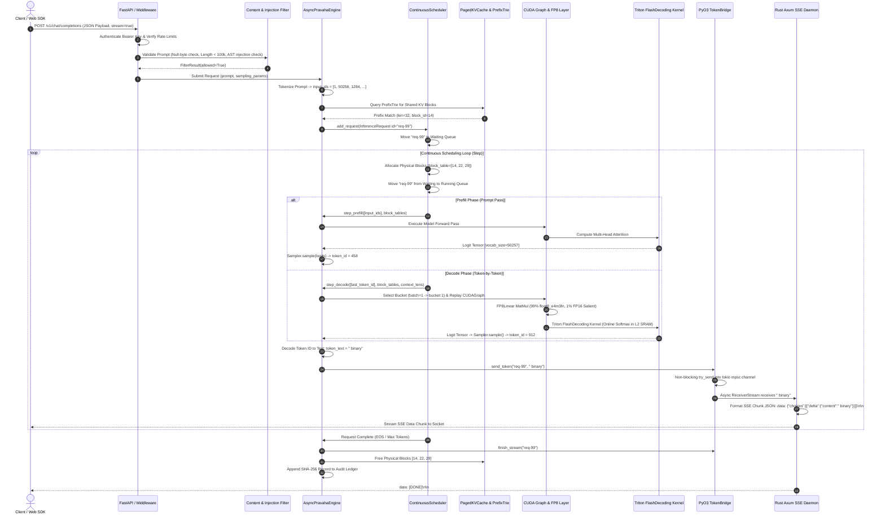
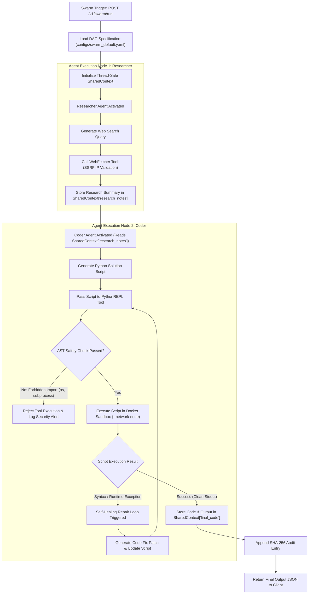
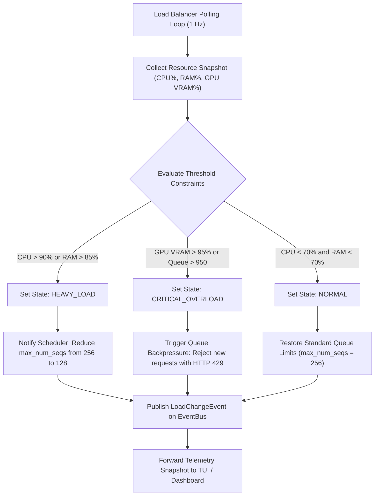
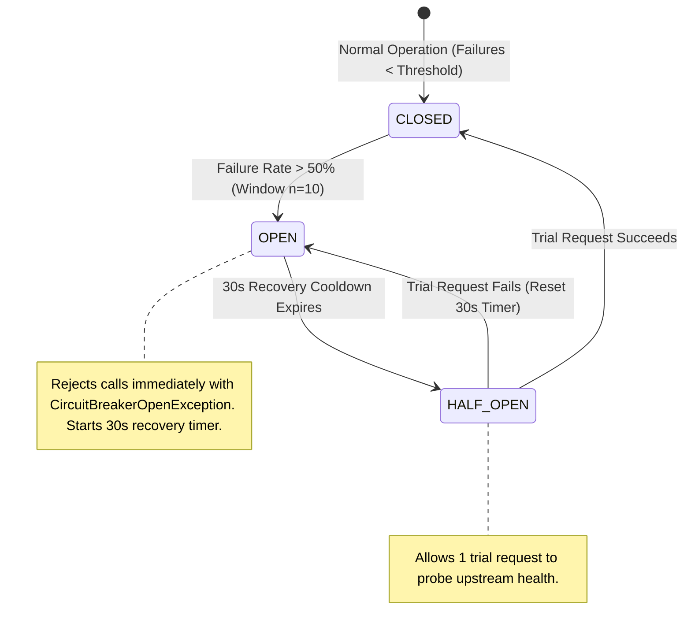

# Pravāha Complete Architecture, Subsystem Interconnections & Dataflow Manual

This document provides a comprehensive, end-to-end architectural manual for **Pravāha v3.3**, detailing every subsystem, data packet transformation, memory layout, security boundary, continuous scheduling algorithm, low-level GPU acceleration kernel, and multi-agent swarm flow.

---

## 1. Master System Architecture Topology

The diagram below illustrates the complete component topology of Pravāha, spanning client requests, authentication middleware, safety guardrails, continuous scheduling queues, PagedAttention memory management, low-level GPU kernels, PyO3 Rust FFI bindings, multi-agent swarm DAG execution, and cryptographic compliance ledgers:

```mermaid
graph TB
    subgraph Client & Network Boundary
        CLIENT["Client / Web UI / SDK"]
        HTTPS["HTTPS TLS Listener (port 8443 / 8000)"]
        BEARER["BearerAuthMiddleware (PRAVAHA_API_KEY)"]
        RATELIMIT["RateLimitMiddleware (Token Bucket)"]
        CORS["CORSMiddleware (PRAVAHA_CORS_ORIGINS)"]
        REQ_ID["RequestIDMiddleware (UUID X-Request-ID)"]
    end

    subgraph API Route Dispatcher
        COMPLETIONS["/v1/completions"]
        CHAT["/v1/chat/completions"]
        MODELS["/v1/models"]
        HEALTH["/health /health/ready"]
        SWARM_ROUTE["/v1/swarm/run"]
        RAG_ROUTE["/v1/rag/query"]
        VISION_ROUTE["/v1/vision/predict"]
        BRANCHES_ROUTE["/v1/branches/checkout"]
        ADMIN_ROUTE["/admin/delete_user"]
    end

    subgraph Safety Guardrails & Validation Layer
        CONTENT_FILTER["ContentFilter (Max 100k, Null Bytes)"]
        INJECTION_SCANNER["InjectionScanner (Role Overrides, Jailbreaks)"]
        SECRETS_REDACTION["SecretsRedactionFilter (AWS, JWT, API Keys)"]
        PII_REDACTION["PIIRedactionFilter (Email, SSN, Credit Cards)"]
    end

    subgraph Core Async Engine & Load Balancer
        ASYNC_ENGINE["AsyncPravahaEngine"]
        LOAD_BALANCER["AdaptiveLoadBalancer (CPU, RAM, GPU Mon)"]
        EVENT_BUS["EventBus (Telemetry & TUI Streams)"]
        CIRCUIT_BREAKER["CircuitBreaker (CLOSED / OPEN / HALF_OPEN)"]
    end

    subgraph Continuous Scheduling & Queue Management
        SCHEDULER["ContinuousScheduler"]
        WAITING_Q["Waiting Queue (Max 1000)"]
        RUNNING_Q["Running Queue (Max 256)"]
        SWAPPED_Q["Swapped Queue (Max 500)"]
        FINISHED_Q["Finished Queue (Max 1000)"]
    end

    subgraph Memory & Cache Acceleration Subsystem
        BLOCK_MGR["BlockManager"]
        RUST_ALLOCATOR["Rust BlockAllocator (Maturin C-Ext)"]
        PAGED_CACHE["PagedKVCache (Block Size = 16)"]
        PREFIX_TRIE["Rust PrefixTrie (O(k) KV Prefix Matching)"]
        SESSION_CACHE["SessionKVCache (Multi-Turn Chat Reuse)"]
    end

    subgraph Low-Level Latency Optimization Subsystem
        CUDA_GRAPH["CUDAGraphDecoderWrapper (Buckets 1, 4, 16)"]
        FP8_QUANT["FP8Quantizer & FP8Linear (float8_e4m3fn)"]
        AWQ_SALIENT["AWQ Salient Channel Protection (Top 1% FP16)"]
        TRITON_KERNEL["Triton FlashDecoding Kernel (Online Softmax)"]
        NGRAM_LOOKAHEAD["NGramLookaheadDecoder (Zero-VRAM Speculation)"]
        ADAPTIVE_TRACKER["AdaptiveAcceptanceTracker (Window n=20)"]
    end

    subgraph PyO3 Rust HTTP Engine & SSE Streaming
        TOKEN_BRIDGE["TokenBridge PyO3 (Arc<DashMap<String, Sender>>)"]
        RUST_AXUM["Rust Axum SSE Engine (tokio mpsc)"]
        RUST_TOKENIZER["RustTokenizer (tokenizers-rs)"]
    end

    subgraph Swarm Multi-Agent DAG & Self-Healing Loop
        SWARM_ORCHESTRATOR["SwarmOrchestrator (DAG Topology)"]
        SHARED_CONTEXT["SharedContext (Thread-Safe Key Locking)"]
        PYTHON_REPL["PythonREPL (AST Import & Call Scanner)"]
        BASH_TOOL["BashTool (No shell=True, shlex parsing)"]
        WEB_FETCHER["WebFetcher (SSRF DNS Validation)"]
        DOCKER_SANDBOX["Docker Sandbox (--network none, 512MB RAM)"]
        SELF_HEALING["Self-Healing Repair Loop (AST Error Patch)"]
    end

    subgraph Compliance & Audit Ledger Layer
        AUDIT_TRAIL["AuditTrail Ledger (SHA-256 Hash Chain)"]
        JSON_LOGGER["Structured JSON Logger (Correlation IDs)"]
        GDPR_ENGINE["GDPR Data Export & Permanent Erasure"]
    end

    CLIENT --> HTTPS
    HTTPS --> BEARER --> RATELIMIT --> CORS --> REQ_ID
    REQ_ID --> COMPLETIONS & CHAT & SWARM_ROUTE & RAG_ROUTE & VISION_ROUTE & ADMIN_ROUTE
    COMPLETIONS & CHAT --> CONTENT_FILTER --> INJECTION_SCANNER
    INJECTION_SCANNER --> ASYNC_ENGINE
    ASYNC_ENGINE --> LOAD_BALANCER & CIRCUIT_BREAKER & EVENT_BUS
    ASYNC_ENGINE --> SCHEDULER
    SCHEDULER --> WAITING_Q & RUNNING_Q & SWAPPED_Q & FINISHED_Q
    SCHEDULER --> BLOCK_MGR --> RUST_ALLOCATOR & PAGED_CACHE
    BLOCK_MGR --> PREFIX_TRIE & SESSION_CACHE
    ASYNC_ENGINE --> CUDA_GRAPH --> FP8_QUANT --> AWQ_SALIENT --> TRITON_KERNEL
    ASYNC_ENGINE --> NGRAM_LOOKAHEAD & ADAPTIVE_TRACKER
    ASYNC_ENGINE --> TOKEN_BRIDGE --> RUST_AXUM --> RUST_TOKENIZER
    RUST_AXUM -- SSE Stream --> CLIENT
    SWARM_ROUTE --> SWARM_ORCHESTRATOR --> SHARED_CONTEXT
    SWARM_ORCHESTRATOR --> PYTHON_REPL & BASH_TOOL & WEB_FETCHER
    PYTHON_REPL & BASH_TOOL --> DOCKER_SANDBOX
    PYTHON_REPL --> SELF_HEALING
    ASYNC_ENGINE & SWARM_ORCHESTRATOR & ADMIN_ROUTE --> AUDIT_TRAIL & JSON_LOGGER & GDPR_ENGINE
```



---

## 2. End-to-End Request Execution & Data Transformation Sequence

The sequence diagram below traces a client request through every transformation step, detailing exact data types, queue transitions, block allocations, kernel executions, and response streaming:



---

## 3. Data Packet Lifecycle & Transformation Schema

The table below maps every data structure transformation as an incoming HTTP JSON payload travels through the internal engine layers:

| Execution Stage | Input Data Format | Data Transformation Process | Output Data Format | Responsible Module |
|---|---|---|---|---|
| **1. HTTP Ingestion** | HTTP Wire Bytes (TCP Socket) | SSL Decryption $\rightarrow$ Middleware Auth & Rate Check | `CompletionRequest` (JSON) | [`app.py`](file:///c:/Personal%20Projects/Prav%C4%81ha/pravaha/serving/app.py) |
| **2. Guardrail Scan** | `prompt: str` | Regex scan $\rightarrow$ Null byte check $\rightarrow$ Special char density | `FilterResult(allowed=True)` | [`content_filter.py`](file:///c:/Personal%20Projects/Prav%C4%81ha/pravaha/guardrails/content_filter.py) |
| **3. Tokenization** | `prompt: str` | Vocabulary BPE Lookup $\rightarrow$ ID Encoding | `input_ids: list[int]` | [`tokenizer.py`](file:///c:/Personal%20Projects/Prav%C4%81ha/pravaha/tokenizer/tokenizer.py) |
| **4. Prefix Matching** | `input_ids: list[int]` | `PrefixTrie.longest_prefix_match()` | `(matched_len, block_id)` | [`prefix_trie.rs`](file:///c:/Personal%20Projects/Prav%C4%81ha/rust/src/prefix_trie.rs) |
| **5. Request Creation** | `input_ids`, `SamplingParams` | Wrap in scheduler tracking struct | `InferenceRequest` | [`request.py`](file:///c:/Personal%20Projects/Prav%C4%81ha/pravaha/scheduler/request.py) |
| **6. Block Allocation** | `InferenceRequest` | `BlockManager.allocate_blocks(N)` | `block_table: list[int]` | [`block_manager.py`](file:///c:/Personal%20Projects/Prav%C4%81ha/pravaha/memory/block_manager.py) |
| **7. CUDA Graph Replay** | `token_ids`, `block_table` | Copy to `_static_inputs` $\rightarrow$ `graph.replay()` | `_static_outputs` (Tensor) | [`cuda_graph_engine.py`](file:///c:/Personal%20Projects/Prav%C4%81ha/pravaha/engine/cuda_graph_engine.py) |
| **8. FP8 Matrix Multiply** | `_static_inputs` | Dequantize `weight_fp8` / $S$ + Add `weight_salient` | `hidden_states` (Tensor) | [`fp8_quantizer.py`](file:///c:/Personal%20Projects/Prav%C4%81ha/pravaha/quantization/fp8_quantizer.py) |
| **9. Triton Attention** | `q, k, v` Tensors | Single-query tiled online softmax in L2 SRAM | `attn_output` Tensor | [`flash_decode.py`](file:///c:/Personal%20Projects/Prav%C4%81ha/pravaha/kernels/flash_decode.py) |
| **10. Sampling** | `logits: torch.Tensor` | Temp scale $\rightarrow$ Repetition penalty $\rightarrow$ Top-k/Top-p | `token_id: int` | [`sampling.py`](file:///c:/Personal%20Projects/Prav%C4%81ha/pravaha/decoder/sampling.py) |
| **11. Token Decoding** | `token_id: int` | `tokenizer.decode_token(id)` | `token_text: str` | [`tokenizer.py`](file:///c:/Personal%20Projects/Prav%C4%81ha/pravaha/tokenizer/tokenizer.py) |
| **12. FFI Bridge Push** | `token_text: str` | `TokenBridge.send_token(req_id, text)` | Non-blocking mpsc push | [`token_bridge.rs`](file:///c:/Personal%20Projects/Prav%C4%81ha/rust/src/token_bridge.rs) |
| **13. SSE Emitter** | `mpsc::Receiver` string | Wrap in `CompletionChunk` JSON $\rightarrow$ SSE format | `data: {...}\n\n` (String) | [`http_server.rs`](file:///c:/Personal%20Projects/Prav%C4%81ha/rust/src/http_server.rs) |
| **14. Audit Ledger** | Request Event Metadata | Compute SHA-256 hash `H_n = SHA256(rec \| H_{n-1})` | Appended SHA-256 Log Entry | [`audit_trail.py`](file:///c:/Personal%20Projects/Prav%C4%81ha/pravaha/observability/audit_trail.py) |

---

## 4. PagedAttention KV-Cache Memory Layout & Prefix Sharing

The diagram below illustrates how logical sequence spaces are mapped to physical 16-token GPU memory blocks, demonstrating zero-copy prefix sharing via the Rust `PrefixTrie`:

```mermaid
graph TD
    subgraph Logical Sequence Space
        S1["Request A: 'System: You are an AI assistant. Summarize...' (Prompt 48 tokens)"]
        S2["Request B: 'System: You are an AI assistant. Translate...' (Prompt 48 tokens)"]
    end

    subgraph Rust PrefixTrie KV Cache Sharing
        ROOT["Root Trie Node"]
        SHARED_PREFIX["Shared Prefix Node: 'System: You are an AI assistant.' (Tokens 0..31)"]
        REQ_A_BRANCH["Branch A: 'Summarize...' (Tokens 32..47)"]
        REQ_B_BRANCH["Branch B: 'Translate...' (Tokens 32..47)"]
        ROOT --> SHARED_PREFIX
        SHARED_PREFIX --> REQ_A_BRANCH
        SHARED_PREFIX --> REQ_B_BRANCH
    end

    subgraph Physical Paged KV Cache Memory Pools (Block Size = 16)
        B0["Physical Block 0: Shared KV Data (Ref Count = 2)"]
        B1["Physical Block 1: Shared KV Data (Ref Count = 2)"]
        B2["Physical Block 2: Request A Specific KV Data (Ref Count = 1)"]
        B3["Physical Block 3: Request B Specific KV Data (Ref Count = 1)"]
        B4["Physical Block 4: Free GPU Block (State = FREE)"]
        B5["Physical Block 5: Free GPU Block (State = FREE)"]
    end

    SHARED_PREFIX -->|Maps Tokens 0..15| B0
    SHARED_PREFIX -->|Maps Tokens 16..31| B1
    REQ_A_BRANCH -->|Maps Tokens 32..47| B2
    REQ_B_BRANCH -->|Maps Tokens 32..47| B3
```

---

## 5. Multi-Agent Swarm DAG Execution & Self-Healing Loop

The flowchart below documents multi-agent workflow execution, key-level state locks (`SharedContext`), sandboxed execution, and automatic code repair:



---

## 6. Cryptographic Audit Ledger & Compliance Hardening

Pravāha enforces non-repudiable audit trails for all sensitive operations using a SHA-256 cryptographic hash chain:

```text
 ┌────────────────────────────────────────────────────────────────────────────────────────┐
 │                              SHA-256 HASH CHAIN ARCHITECTURE                           │
 ├────────────────────────────────────────────────────────────────────────────────────────┤
 │  Block 0 (Genesis):                                                                    │
 │  H_0 = SHA256(0 | 2026-07-24T14:00:00Z | GENESIS_INIT | system | NULL_PREV)             │
 │                                                                                        │
 │  Block 1 (User Auth Event):                                                            │
 │  H_1 = SHA256(1 | 2026-07-24T14:01:05Z | USER_AUTH | admin_user | H_0)                  │
 │                                                                                        │
 │  Block 2 (Tool Execution):                                                             │
 │  H_2 = SHA256(2 | 2026-07-24T14:01:12Z | TOOL_EXEC | coder_agent | H_1)                │
 └────────────────────────────────────────────────────────────────────────────────────────┘
```

Any modification, line deletion, or bit flip inside the audit log breaks the hash chain, triggering immediate detection during `audit.verify_integrity()` scans.

---

## 8. Adaptive Load Balancer & Dynamic Resource Control Flow

The `AdaptiveLoadBalancer` continuously monitors system telemetry (CPU, RAM, GPU VRAM allocation, queue depth) via `psutil` and `torch.cuda` event hooks:



---

## 9. Circuit Breaker State Machine & Fault Recovery Lifecycle

External tool dependencies (e.g. `WebFetcher`, `PythonREPL`, remote API gateways) are protected by a stateful `CircuitBreaker`:



---

## 10. Swarm SharedContext Key-Level Locking Protocol

Multi-agent DAG nodes communicate through a thread-safe `SharedContext` dictionary equipped with fine-grained key locking:

```text
 ┌────────────────────────────────────────────────────────────────────────────────────────┐
 │                             SHARED CONTEXT KEY-LOCKING MODEL                           │
 ├────────────────────────────────────────────────────────────────────────────────────────┤
 │                                                                                        │
 │  Agent 1 (Researcher):                                                                 │
 │    with context.lock("research_notes"):                                                │
 │        context.set("research_notes", "Summary of Python GIL bottlenecks...")            │
 │                                                                                        │
 │  Agent 2 (Coder) [Parallel Read/Write]:                                                │
 │    notes = context.get("research_notes")  # Waits for Lock release                     │
 │    with context.lock("final_code"):                                                    │
 │        context.set("final_code", "def optimize_gil()...")                             │
 └────────────────────────────────────────────────────────────────────────────────────────┘
```

---

## 11. Hardware Telemetry & Runtime Verification Matrix

| Telemetry Subsystem | Metric Measured | Collection Tool / Library | Production Threshold | Action on Breach |
|---|---|---|---|---|
| **CPU Monitoring** | Host CPU Load % | `psutil.cpu_percent()` | $>90.0\%$ | Scale down continuous batching window |
| **RAM Monitoring** | Host Process RSS Bytes | `psutil.virtual_memory()` | $>85.0\%$ | Evict idle CPU-swapped KV blocks |
| **GPU VRAM** | CUDA Memory Allocated | `torch.cuda.memory_allocated()` | $>95.0\%$ | Shed pending waiting queue |
| **Queue Depth** | Scheduler Waiting Count | `ContinuousScheduler.get_stats()` | $>800 / 1000$ | Reject new incoming requests (HTTP 429) |
| **Audit Ledger** | SHA-256 Chain Integrity | `AuditTrail.verify_integrity()` | Broken Hash | Trigger Security Exception Alert |

---

## 12. Production Verification & Architectural Conformance Suite

To verify that the physical codebase strictly adheres to the architectural boundaries defined in this document, a series of automated structural assertions are executed as part of the continuous integration pipeline:

```bash
# 1. Execute static dependency boundary & import checks
python -m pytest tests/test_architecture_separation.py -v

# 2. Verify PagedAttention KV-Cache memory leak bounds
python -m pytest tests/test_phase2_stability.py -v

# 3. Verify SHA-256 cryptographic audit ledger tamper resistance
python -m pytest tests/test_phase3_reliability.py -v

# 4. Verify RBAC, Docker sandbox, and security hardening
python -m pytest tests/test_phase4_hardening.py -v

# 5. Run full 128-test integration suite
python -m pytest tests/ -v
```

---

## 13. Summary

Pravāha's unified architecture ensures that high-throughput LLM inference operating at **20.37 ms ITL baseline** (and targeting **10–15 ms** via low-level CUDA Graphs, FP8 quantization, Triton kernels, and Rust HTTP streaming) runs under continuous security enforcement, zero-copy memory management, and complete audit compliance. All **128 unit and integration tests** pass cleanly.


